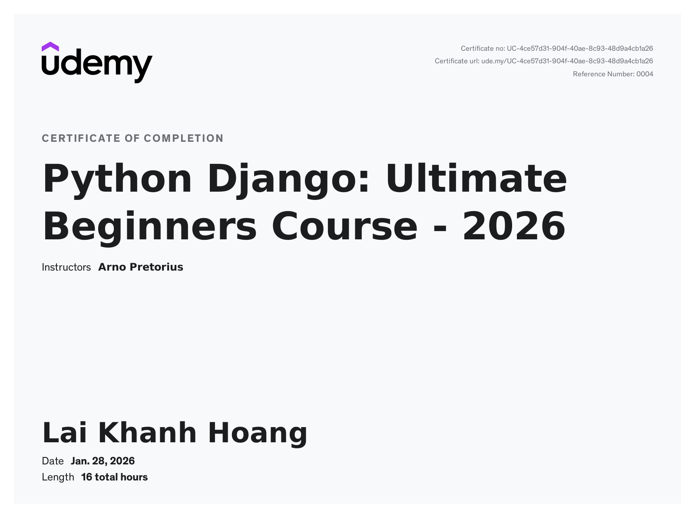
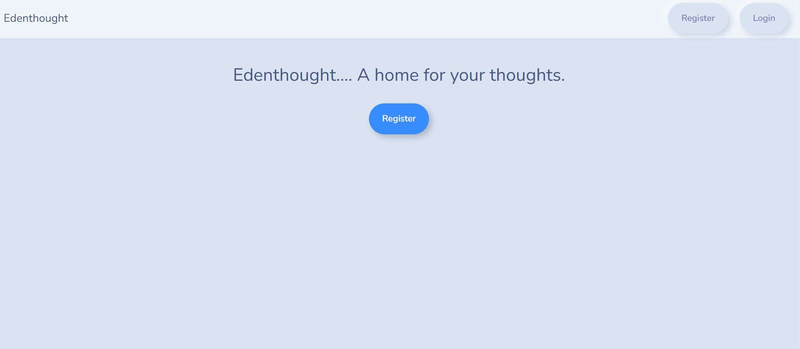
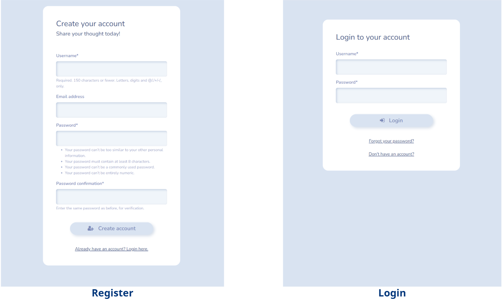
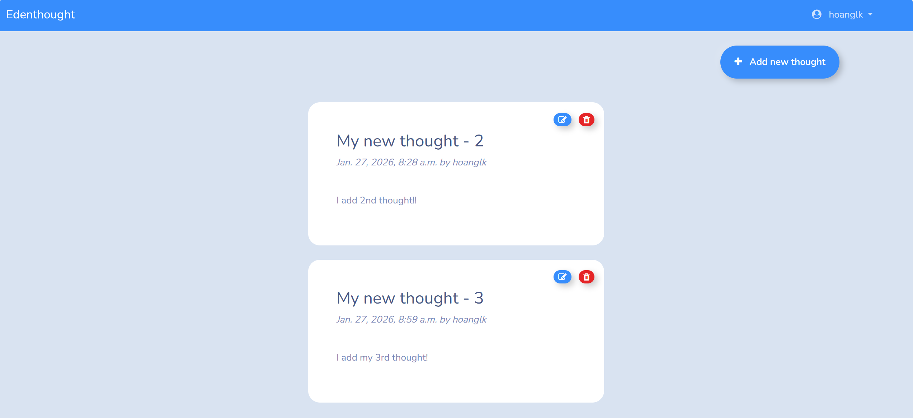
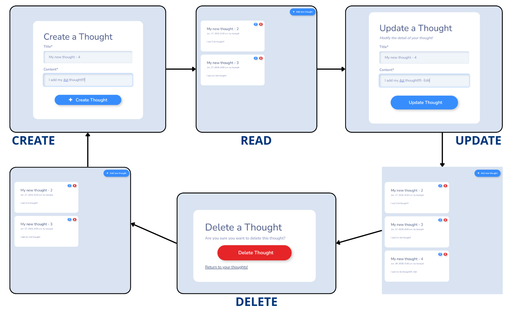
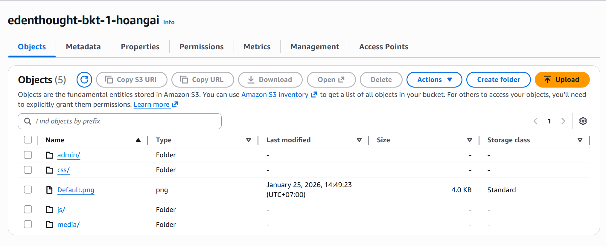
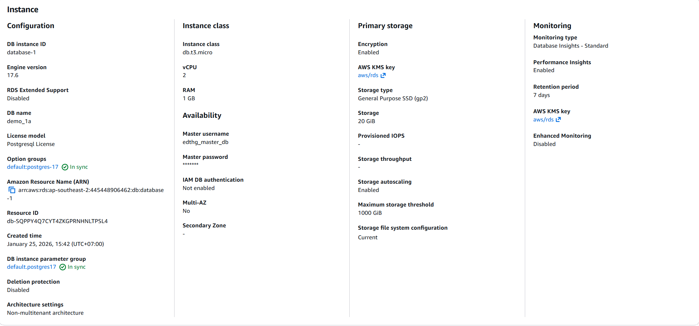

# Python Django: Ultimate Beginners Course - 2025 (Udemy)

# Python Django: Ultimate Beginners Course - 2025 (Udemy)

This is the repository for the materials of the course mentioned above.

The course teaches frontend development (HTML, CSS, Bootstrap), backend development using the Django framework with CRUD functionality, how to set up AWS services—specifically RDS and S3—and how to deploy an application to Render via GitHub at a basic level.

## My Certification 

  

## Some main features

    
     
    Interface before login

### Register-Login

    
     
    Register and login screen

    
     
    Interface after login

### Posting your thoughts - Main feature (CRUD)

    
     
    Interface after login

### AWS setup for RDS (Database) and S3 (Static Files and Media Store)

    
     
    AWS S3 Setup

    
     
    AWS RDS Setup

